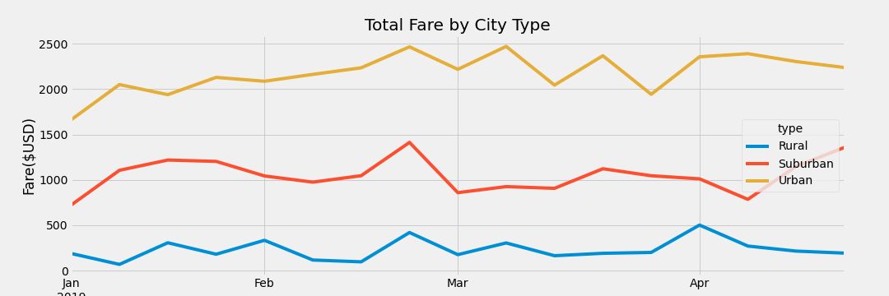

# PyBer Analysis

## Overview of Project
The following project will look to an analysis of data for PyBer, a Python-based app company for ride-sharing services. The analysis will focus on a breakdown of the ride-sharing data based on three types of cities that PyBer operates in – Urban, Suburban, and Rural.

### Purpose
The resulting analysis of the ride-sharing data will provide a summary of differences between the types of cities and the impact on fares and drivers. The information should help to inform better decisions on the accessibility of PyBer’s services for all riders and increase affordability for underserviced areas. The analysis will make use of the capabilities of Python and Jupyter Notebook in addition to the visualization by Matplotlib.

## Results
The below will provide insight on the differences in ride-sharing data among the different city types, including Urban, Suburban and Rural.

The table illustrates a summary of ride-sharing data based on city type.

*Table 1 – Ride-sharing Data/ City*

As can be seen in *Table 1*, Urban cities have:
* The highest number of rides
* The highest number of drivers
* The highest amount of total fares collected

Suburban cities rank second for the above and Rural cities last. The high use of PyBer in Urban cities can perhaps be explained by their population density as well as the availability of the service. With the amount of drivers available, it is easy to hail a ride-share service.

*Figure 1 – PyBer Ride-Sharing Data (2019)*

*Figure 1* presents a visualization of the ride-sharing data per city type. Each circle or data point represents the number of rides per city and the average fare charged. The size of each circle correlates with the driver count per city. As can be seen, Urban cities have the highest number of rides and number of drivers but charge lower fares than Suburban and Rural cities. Rural cities represent the highest average fare price per ride and per driver. Looking across the figure, the amount of rides increase in density, reinforcing the idea that Rural areas are not well-serviced by PyBer or do have high usage.

*Figure 2 – Percentage of Total Rides by City Type*

Urban cities have 68.4% of total rides, with Suburban and Rural cities having 26.3% and 5.3% of rides respectively.

*Figure 3 – Total Fare by City Type*

*Figure 3* shows the variations in total fares by city type per week across the months of January to April in 2019. Rural cities consistently have the highest fare rates, far above those of Suburban and Urban cities. The higher average fare per ride and per driver may be due to the lower demand and supply in these areas. The lack of drivers present may be a driver to the high prices charged. The lack of density of rural areas can also mean a great distance of travel per trip, incurring a higher fare rate. Since there are not a lot of competition between the available drivers, it allows for a greater ability to charge more per ride.

*Figure 4 – Driver Count Data*

This box-and-whisker plot shows the statistical breakdown and comparison of the driver count across all three types of cities. As previously mentioned, drivers in Rural cities account for the lowest proportion from PyBer.

## Summary
In summary, this project looked to provide an analysis of the ride-sharing data with the differences between the types of cities and the impact on fares and drivers. Based on the above information, the following are recommendations to be made to the PyBer CEO in order to address the disparities in use of PyBer, access of PyBer and the fare collected per ride:

1. The number of drivers available in Urban cities should be limited or capped. There are various approaches to take – PyBer can implement shifts for drivers or overall restrict the number of drivers employed in each Urban city. The high volume of drivers contributes to a lower fare price as there is a higher supply available. Despite the higher demand in Urban cities, the availability of drivers mean that there is greater competition. Conversely, the number of drivers should be increased for Rural areas. The availability will help to encourage more use if the convenience can be highlighted against driving oneself. PyBer can make use of campaigns or incentives to boost the interest in individuals to drive for PyBer in Rural cities.
2. Further analysis should be done to examine the fluctuations in use of PyBer across time in order to establish if there are peak times of use for PyBer in each area. Surge pricing can be used to capitalize on the higher demand. Relating to the first recommendation, surge pricing can be done along-side the shifts for drivers in order to regulate supply. As Suburban cities are in between Urban and Rural in terms of metrics, the structure of drivers and fares can be used as an indicator of a fair balance to aspire to.
3. The fare prices charged in Rural cities should be lowered or subsidized by PyBer in order to establish more use of the service initially. Rural cities typically have less complex public infrastructure established meaning individuals are likely choosing between driving personal vehicles or hailing a ride-share for transportation. There needs to be appeal in paying for a ride-share instead of driving individually. In doing so, the total fares in Rural cities should increase following the increase in drivers. PyBer should take the opportunity to establish a committed book of business in these Rural cities to become the trusted ride-share company before similar competition from other companies arrive. There is a high chance of other options already being available in Urban and even Suburban areas from other ride-sharing apps.